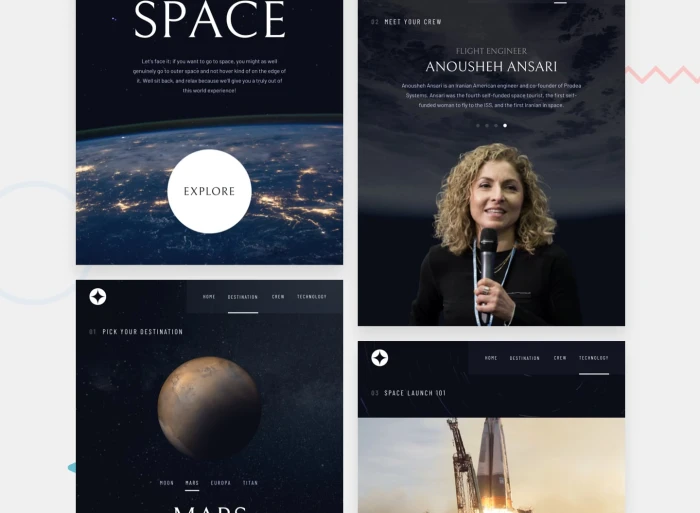

# Space Tourism

> Projeto desenvolvido com base em especificações de um desafio da plataforma [FrontendMentor](https://www.frontendmentor.io/challenges/space-tourism-multipage-website-gRWj1URZ3).

#### Tecnologias utilizadas:

- React
- Swiper.js
___

### Imagens:

