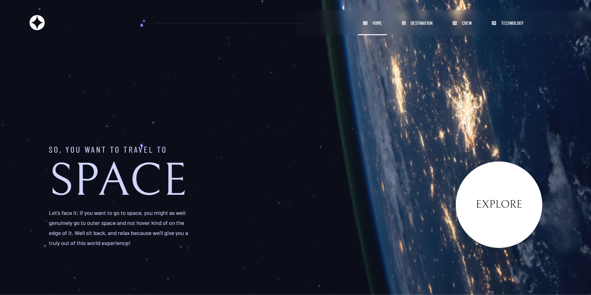

# Frontend Mentor - Space tourism website solution

This is a solution to the [Space tourism website challenge on Frontend Mentor](https://www.frontendmentor.io/challenges/space-tourism-multipage-website-gRWj1URZ3). Frontend Mentor challenges help you improve your coding skills by building realistic projects. 

## Table of contents

- [Overview](#overview)
  - [The challenge](#the-challenge)
  - [Screenshot](#screenshot)
  - [Links](#links)
- [My process](#my-process)
  - [Built with](#built-with)
  - [What I learned](#what-i-learned)
  - [Continued development](#continued-development)
  - [Useful resources](#useful-resources)
- [Author](#author)

## Overview

### The challenge

Users should be able to:

- View the optimal layout for each of the website's pages depending on their device's screen size
- See hover states for all interactive elements on the page
- View each page and be able to toggle between the tabs to see new information

### Screenshot



### Links

- Solution URL: [Add solution URL here](https://your-solution-url.com)
- Live Site URL: [Add live site URL here](https://your-live-site-url.com)

## My process

### Built with

- Semantic HTML5 markup
- CSS custom properties
- Flexbox
- CSS Grid
- [React](https://reactjs.org/) - JS library
- [Swiper](https://swiperjs.com/) - For sliders

### What I learned


### Continued development

- I learned about flex-shrink and flex-grow. I did'nt know how to use these properties well.
By default flex items has it values defined by flex-shrink 1, meaning they can shrink If necessary, in some parts of the code I needed it to change.

```css
    flex-shrink: 1; // By default is defined as 1
    flex-grow: 0; // In some case you may need to change it to 1 and shrink to 0
```

- I already knew React, but working in this project I could study on it without following a step-by-step process and get down to it. I think I want to study more about React as well as I know about Vue.

### Useful resources

- [Swiper](https://swiperjs.com/) - This helped me in crew page, and using it I've learned new options in the library.

- [Flex CSS](https://origamid.com/projetos/flexbox-guia-completo/) and [Grid CSS](https://www.origamid.com/projetos/css-grid-layout-guia-completo/) - Here you can find a complete guide that can help you clear up some doubts about these layouts.

## Author

<!-- - Website - [Pablo Moraes](https://www.your-site.com) -->
- Frontend Mentor - [@pablo-moraes](https://www.frontendmentor.io/profile/pablo-moraes)
- LinkedIn - [Pablo Moraes](https://www.linkedin.com/in/pablo-moraes001/)
